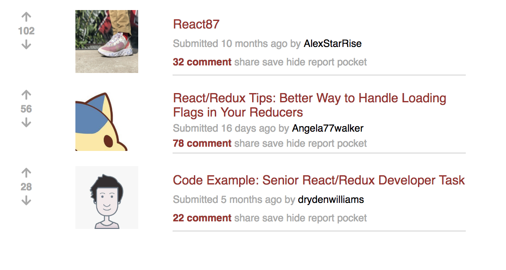

## Reddit Project
- It is a simple Reddit Project, built with ReactJS.

## App Functionality

The project shows a list of posts. 
Each post displays the image, the number of votes and the number of comments.

Users should be able to 
- upvote and downvote the number of votes
- click the title of each post and navigate to the linked page

## Project Screenshot

## Installation Instructions
- clone my repo git clone https://github.com/mavisluan/reddit.git
- install all project dependencies with yarn install
- start the development server with yarn start
